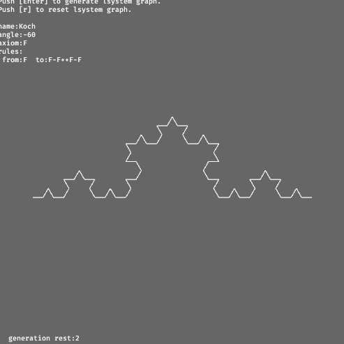

# lsystem



[lsystem](https://en.wikipedia.org/wiki/L-system) which simulates patters like growth of plants.
This is implemeented by bevy.
A pattern of lsystem is randomly selected per resets.

## Operation
- Enter : lsystem granph
- r : restart

## build as wasm

```shell
## ref: https://bevy-cheatbook.github.io/platforms/wasm.html

## if you dont have wasm32-unknown-unknown
rustup target install wasm32-unknown-unknown

## good for test but you can skip these
cargo install wasm-server-runner
export CARGO_TARGET_WASM32_UNKNOWN_UNKNOWN_RUNNER=wasm-server-runner

## build commands
cargo build --release --target wasm32-unknown-unknown 
wasm-bindgen --target web --out-dir ./wasm ./target/wasm32-unknown-unknown/release/bevy_lsystem.wasm
```

## Sample Page
[https://nulldrift.com/warehouse/lsystem](https://nulldrift.com/warehouse/lsystem)